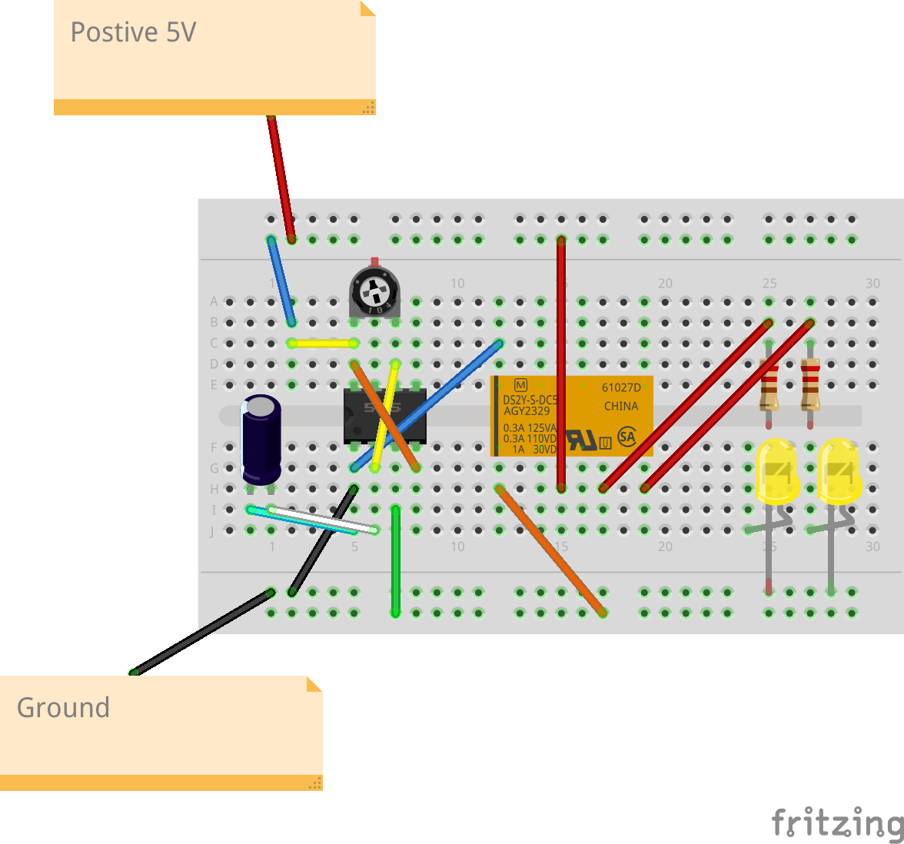
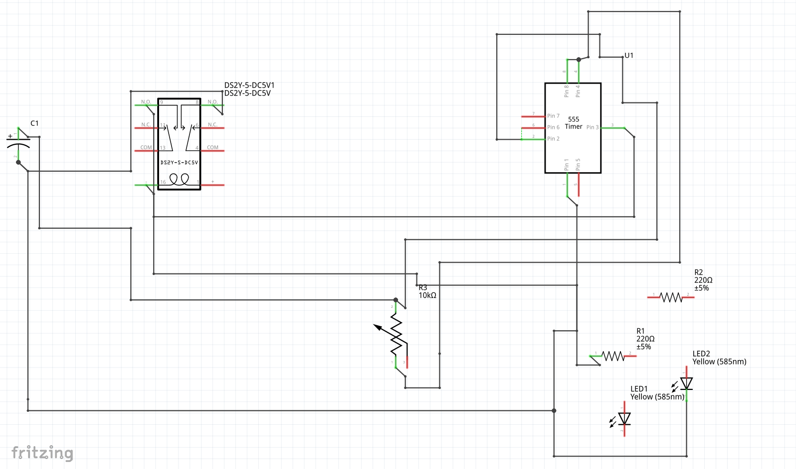

# Indecision

## Overview

Desk Art

## Table of Contents

- [Features](#features)
- [Materials](#materials)
- [Setup](#setup)
- [Usage](#usage)
- [Contributing](#contributing)
- [License](#license)

## Features

Key features of your breadboard project.

- If you implement this circuit you will have a set of leds  tick/tock flashing back and forth.
- The speed (and if they flash as all) is controllabled via the trimpot.
- Fun 
- Hypnotic
- Inspiration for decision making

## Materials

Materials required to replicate the project:

- 555 Timer
- 5V Relay
- 2 x 220 Ohm R
- 2 x yellow LEDs
- Some jumper cables
- 10 k TrimPot
- 400 point breadboard

(All available at jameco.com or other electronics online stores)

## Setup

How to set up the breadboard project. 

| 555 Pin  | Name     | Description                                           |
|------|----------|-------------------------------------------------------|
| 1    | GND      | Ground. Connect to the ground reference of your circuit. |
| 1    | GND      | Jumper this to the Relay's input/coil|
| 1    | GND      | Jumper this to 10uf Capacitor (or place in line)|
| 2    | TRIG     | Jumper this to Pin 6 |
| 2    | TRIG     | Jumper this to 10uf Capacitor (or place in line)|
| 3    | OUT      | Jumper this to the outer rail|
| 4    | RESET    | Jumper this to Pin 8 |
| 5    | CTRL     | Leave Alone|
| 6    | THR      | Already jumpered to Pin 2|
| 6    | THR      | Keep in line with right leg of TrimPot |
| 7    | DISCH    | Keep in line with middle leg of TrimPot|
| 8    | VCC      | Keep in line with left leg of TrimPot |
| 8    | VCC      | Connect to 5V VCC |

| Relay Pin  |Description|
|------|----------|
| Common| Connect to +5V power|
| Common| Optional - Connect to second +5V power for a more elaborate effect|
| Coil  | Connect to outer rail (shared with Pin 3 of 555 timer)|
| NO    | Connect to LED|
| NC    | Connect to LED|

| LED | Description|
|-----|------------|
| Cathodes | Connect to resistors|
| Anode   | Connect to GND|

## BreadBoard pics
(See /images for pdf, fzz and others)

## Movie
[Movie](https://github.com/jouellnyc/indecision/raw/main/images/movie.mp4)

## Schematic (Export from Fritzing for convenience)

